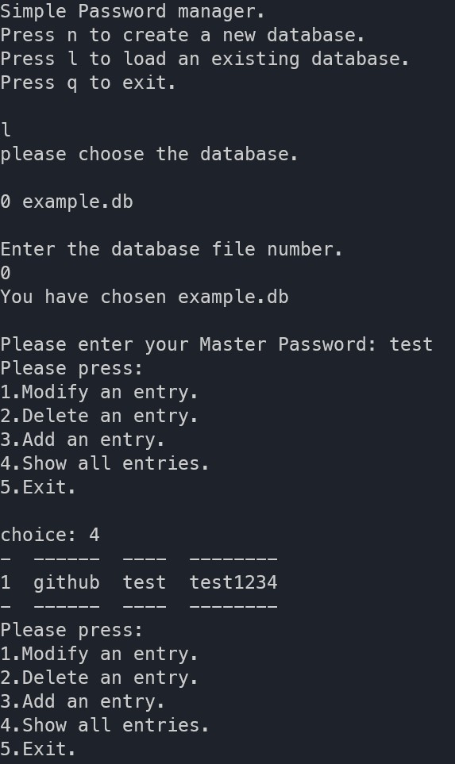

<h1 align="center">simple password manager</h1>

<div align="center">
Simple minimalistic password manager written in python.
</div>

## 🚀Motivation

This is actually a project assignment for the course [Introduction to Security](https://pablo.rauzy.name/teaching/is/).

## Features

- Passwords are stored in an encrypted SQLite database.
- Master key is used with a salt for more security.
- Possibility to create an unlimited number of entries.
- Clear clipboard automatically.
- Generate random passwords.

## TODO

- Automatically close if inactivity.
- Search for a specific entry.

## Requirements

```python
pip3 install pyperclip
```

## Usage

```python
python3 project.py
```



## Explanations

- `mysalt`: is the salt mixed with the Master key for encryption and decryption.
- `final_key`: is the result of the mix between the Master key and the salt.
- `derived`: when using the kdf for the mix, it's only possible to call it once,
  so this boolean will tell us if we already mixed anything or not yet, and according
  to that we use different parts of the code for encrypting and decrypting.
- `kdf`: is used for deriving a cryptographic key from the Master password.
- `enc_fernet`: is the function used to encrypt the database, we start by reading,
  the unencrypted database in a binary way, then we check if we already used the kdf,
  if not we start by transforming the user's password into bytes then derive it with kdf,
  after that is the final step which consist of using the `base64.urlsafe_b64encode` method.
- `base64.urlsafe_b64encode`: is the method that encodes the result of the mixing into a binary form.
  Then we use that key as the final one in order to encrypt the database.
- `dec_fernet`: is the function used to decrypt the database, it is exactly the same as,
  `enc_fernet` we just use the decrypt method to decrypt the file instead of the encrypt method.

## Problems encountered

Adding the entries to a database wasn't a problem at all. I really struggled with finding a way to correctly,
encrypt and decrypt the database with any master key, at first I really tried going from scratch and implementing my own,
CBC encryption and decryption the same way we did in the course with the first assignment, The only problem was with the key,
the way it was implemented it would only encrypt and decrypt from a key in the form of a list containing 2 ints, and of course,
that can never be a encryption system for a password manager, not even for a prototype one. That is why I decided to use,
the Fernet encryption for this project, thanks to the cryptography lib. It is simple to implement and does the job correctly.

## Resources

- 
- 
- 
- 
- 
- 
- 
